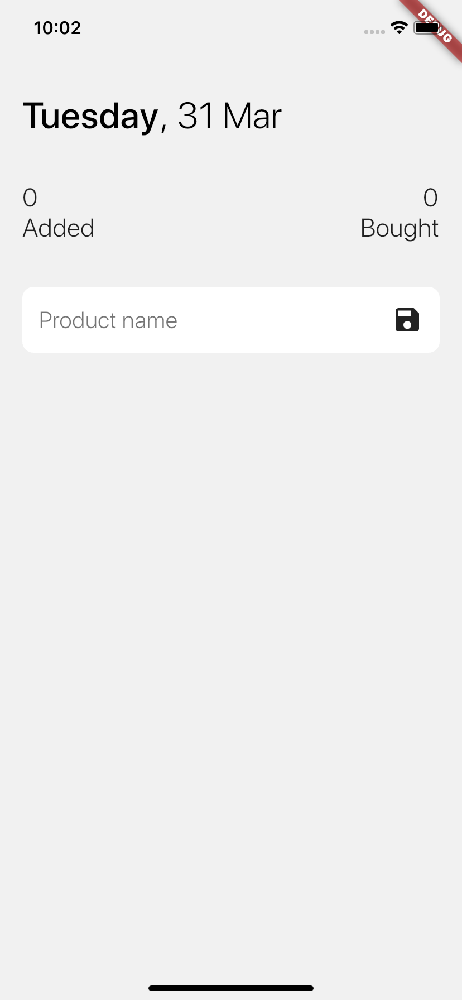
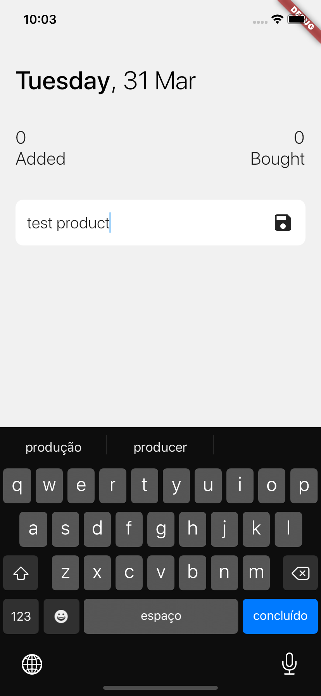
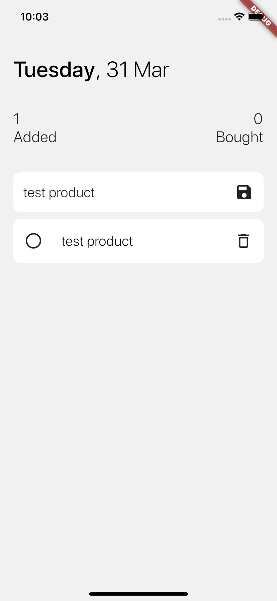
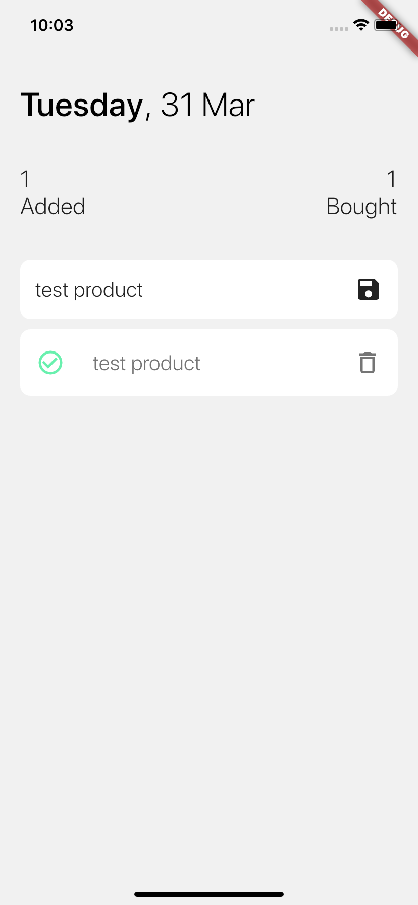

<h1 align="center">Market List</h1>

A simple application built with Flutter, but using some important topics as state management with [Mobx](https://mobx.netlify.com/) and local data persistence with [SQLite](https://pub.dev/packages/sqflite). Feel free to clone this project, learn with it or fix their problems and send me back as a pull request.

<p align="center">
  
  
  
  
</p>

## Useful Links
 - [Flutter com MobX (Portuguese text)](https://medium.com/flutter-comunidade-br/flutter-com-mobx-c0f4762fbd1a)
 - [Persist data with SQLite](https://flutter.dev/docs/cookbook/persistence/sqlite)

## How to use
To clone and run this application, you'll need [Git](https://git-scm.com/downloads) and [Flutter](https://flutter.dev/docs/get-started/install) installed on your computer. From your command line:

```
# Clone this repository
$ git clone https://github.com/feMoraes0/market-list.git

# Go into the repository
$ cd market-list

# Install dependencies
$ flutter packages get

# Run the app
$ flutter run
```

## Design
 - [Todo List - App Design by Shoaib Sayyed](https://dribbble.com/shots/5642001-Todo-List-App-Design)

## Contact
  - <a target="_blank" href="https://www.linkedin.com/in/fernando-moraes-48a26916a/">LinkedIn</a>
  - <a target="_blank" href="mailto:fernandomoraes.lopes@gmail.com">E-mail</a>
